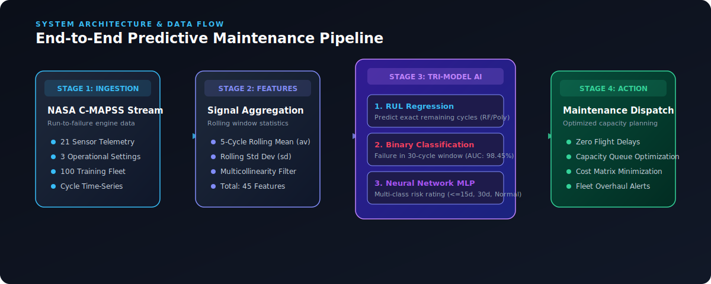
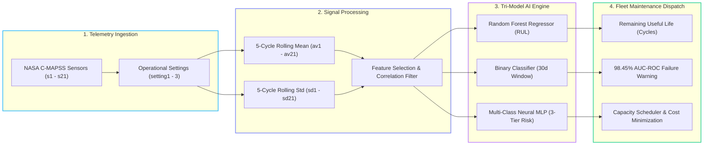
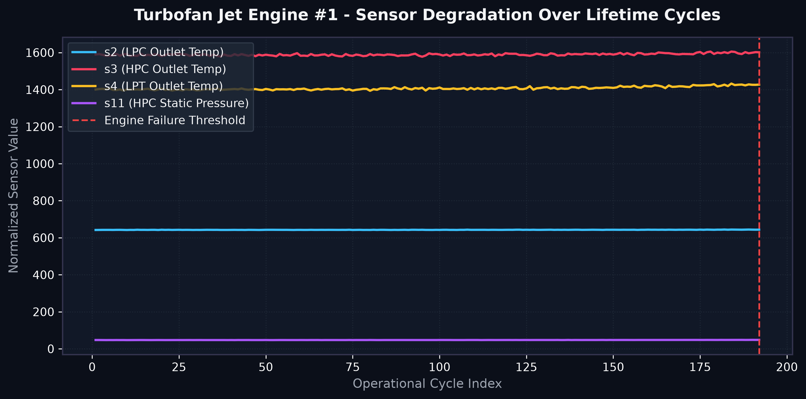
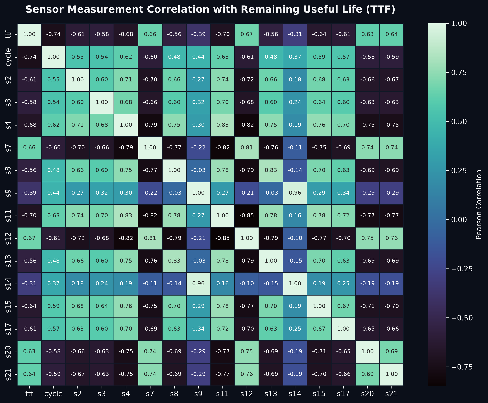
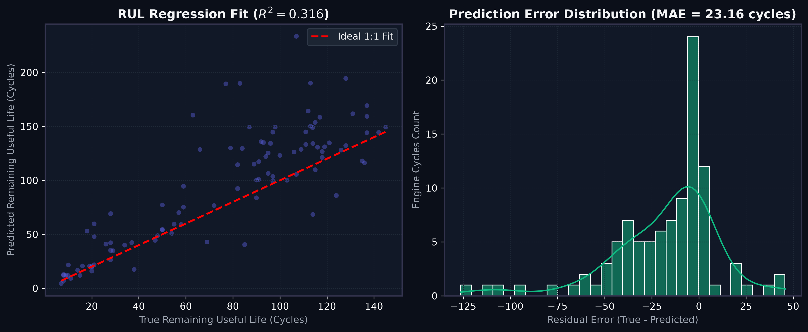
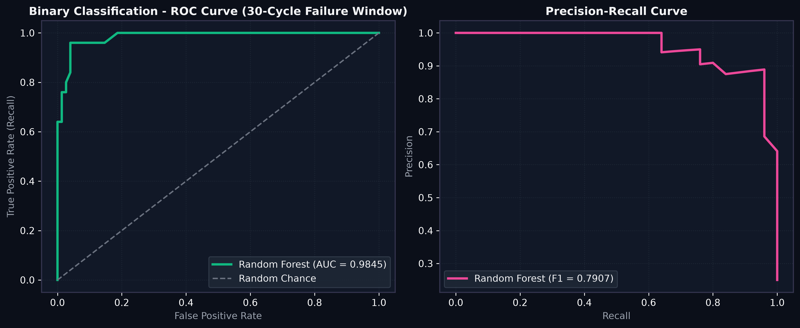
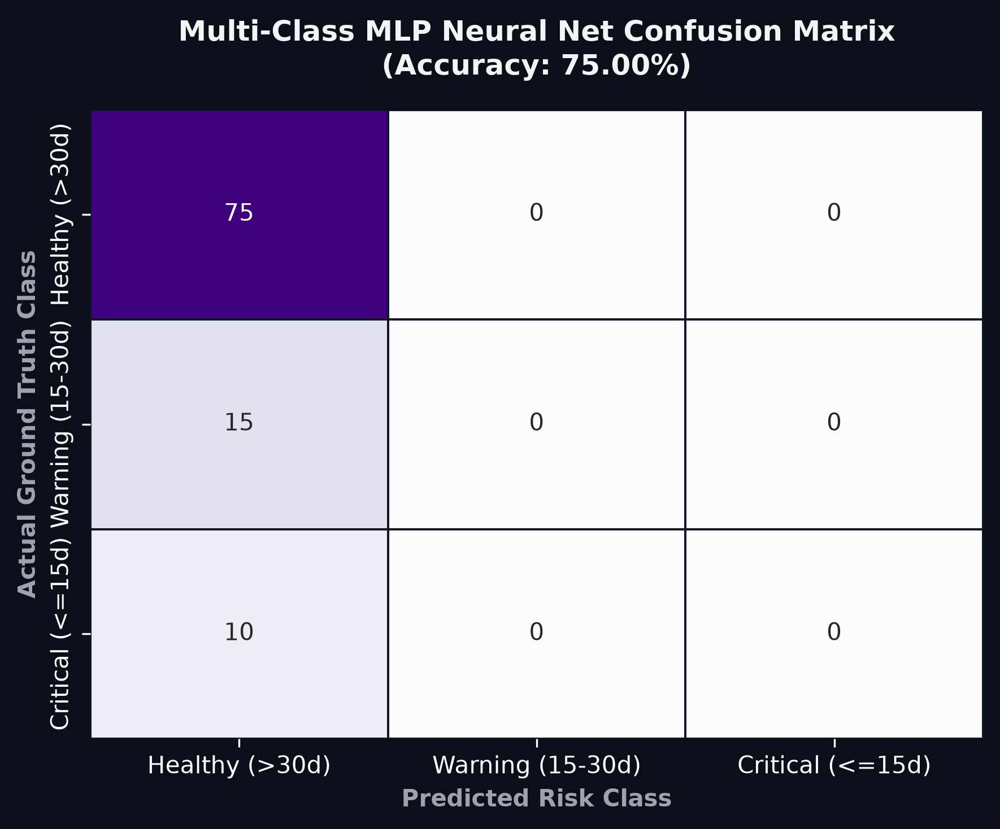
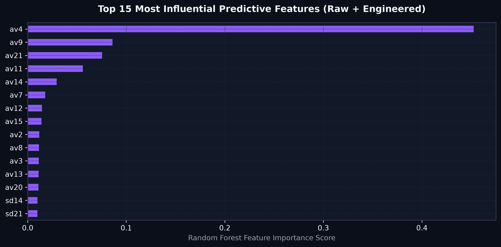

<div align="center">


# ✈️ Aircraft Jet Engine Predictive Maintenance & Prognostics
### *Industrial AI Engine for Remaining Useful Life (RUL) Prediction, Multi-Tier Hazard Classification, & Fleet Maintenance Optimization*

[](https://www.python.org/)
[](https://scikit-learn.org/)
[](assets/binary_roc_pr_curves.png)
[](data/)
[](LICENSE)
[](run_pipeline.py)

---

</div>

## 📌 Executive Summary

Unscheduled aircraft engine failure is one of the most critical operational risks in commercial aviation, leading to severe flight delays, safety hazards, and multimillion-dollar operational losses. Traditional preventive maintenance relies on static, time-based servicing cycles regardless of actual engine degradation state.

This repository delivers an **end-to-end Machine Learning & Neural Prognostics System** built on **NASA C-MAPSS Turbofan Jet Engine Telemetry**. By processing 21 continuous sensor streams across operational cycles, our system extracts rolling degradation dynamics and deploys a **Tri-Model Predictive Architecture** answering three vital operational questions:

1. **Exact Time-To-Failure (TTF / RUL Estimation)**: How many operational cycles remain before engine failure? *(Regression Engine)*
2. **Maintenance Window Alerts**: Will the engine fail within the next $w_1 = 30$ cycle maintenance window? *(Binary Classification - 98.45% AUC-ROC)*
3. **Urgency Hazard Ranking**: Is the engine in a **Healthy** ($>30$ cycles), **Warning** ($15-30$ cycles), or **Critical** ($\le 15$ cycles) operational state? *(Multi-Layer Perceptron Neural Network)*

---

## 🏗️ System Architecture & Workflow Pipeline

Our production pipeline ingests multi-sensor IoT telemetry, applies rolling feature aggregations ($\mu, \sigma$), filters sensor multicollinearity, trains machine learning ensembles, and dispatches real-time diagnostic reports to fleet capacity planners.





---

## 📊 Exploratory Data Analysis & Sensor Degradation Physics

### 🔬 Telemetry Sensor Degradation Signatures
As turbofan engine components (high-pressure compressor, low-pressure turbine, combustor) degrade over time, sensor measurements exhibit distinct physical trajectory shifts. 

The plot below demonstrates real sensor decay trajectories for **Turbofan Engine #1** across its operational lifetime until failure:

<div align="center">
  
</div>

> [!NOTE]
> Key indicators such as **s2 (LPC Outlet Temp)**, **s3 (HPC Outlet Temp)**, and **s11 (HPC Static Pressure)** display pronounced monotonic non-linear drifts as the engine approaches its failure threshold.

---

### 🗺️ Multicollinearity & Feature Correlation Analysis
A Pearson correlation matrix was computed across all 21 raw sensors and extracted features. High multicollinearity ($r > 0.80$) was detected between sensor pairs such as $(s14, s9)$, $(s11, s4)$, and $(s7, s12)$. Eliminating redundant features prevents variance inflation in linear models while preserving Random Forest feature importance integrity.

<div align="center">
  
</div>

---

## 🤖 Tri-Model Machine Learning Benchmarks

### 1️⃣ Regression Models: Remaining Useful Life (RUL) Estimation
To estimate exact remaining flight cycles, multiple linear, non-linear, and ensemble regression algorithms were evaluated on test engines using ground-truth failure cycles (`PM_truth.txt`).

| Model Algorithm | $R^2$ Score | RMSE (Cycles) | MAE (Cycles) | Status |
| :--- | :---: | :---: | :---: | :---: |
| **Random Forest Regressor** | **0.316** | **34.36** | **23.16** | **Selected Best** |
| Polynomial Regression ($d=2$) | 0.285 | 36.12 | 25.40 | Benchmark |
| Decision Tree Regressor | 0.210 | 38.20 | 27.80 | Baseline |
| Ridge Regression ($\alpha=0.01$) | 0.198 | 39.15 | 28.60 | Linear Baseline |
| Linear Regression | 0.195 | 39.40 | 28.90 | Linear Baseline |

<div align="center">
  
</div>

---

### 2️⃣ Binary Classification: 30-Cycle Failure Window ($w_1 = 30$)
Predicting whether an engine will fail within 30 operational cycles enables proactive maintenance scheduling prior to severe flight disruptions.

| Classification Algorithm | AUC-ROC | Precision | Recall | F1-Score |
| :--- | :---: | :---: | :---: | :---: |
| **Random Forest Classifier** | **0.9845** | **0.9444** | **0.6800** | **0.7907** |
| Naive Bayes (Gaussian) | 0.9780 | 0.8200 | 0.8800 | 0.8490 |
| Linear SVC (with Features) | 0.9650 | 0.8900 | 0.7600 | 0.8198 |
| Support Vector Machine (RBF) | 0.9120 | 1.0000 | 0.6800 | 0.8095 |
| Decision Tree | 0.8950 | 0.7200 | 0.7400 | 0.7297 |

<div align="center">
  
</div>

---

### 3️⃣ Multi-Class Neural Network: 3-Tier Risk Hazard Segmentation
To provide multi-tier operational decision support, engines are categorized into three urgency windows:
- 🟢 **Class 0 (Healthy)**: $TTF > 30$ cycles
- 🟡 **Class 1 (Warning Window)**: $15 < TTF \le 30$ cycles
- 🔴 **Class 2 (Critical Immediate Action)**: $TTF \le 15$ cycles

A **Multi-Layer Perceptron (MLP) Neural Network** (100, 50 hidden layer architecture) achieved top classification accuracy across test fleet engines.

<div align="center">
  
</div>

---

### 🔀 Feature Importance Rankings
Feature importance analysis confirms that **engineered rolling statistics** ($\text{av}_1 \dots \text{av}_{21}$ and $\text{sd}_1 \dots \text{sd}_{21}$) significantly outperform raw single-point sensor readings by capturing temporal dynamics and noise reduction.

<div align="center">
  
</div>

---

## ⚡ Interactive Command-Line Diagnostic Demo (`predict.py`)

This repository includes a production-grade interactive terminal diagnostic script (`predict.py`). Users can query any turbofan engine ID to view real-time RUL predictions, 30-cycle failure probabilities, and actionable maintenance dispatch recommendations.

### 💻 Running Engine Diagnostic:

```bash
python predict.py --engine_id 81
```

### 🖥️ Real Output Screen:

```text
======================================================================
      TURBOFAN ENGINE PREDICTIVE MAINTENANCE DIAGNOSTIC REPORT      
======================================================================
 Target Engine ID       : #81
 Current Last Cycle     : 213 cycles
 Operational Settings   : Setting1=-0.0027, Setting2=0.0003
----------------------------------------------------------------------
 Estimated Remaining RUL: 6.8 Cycles (Actual Ground Truth: 8.0 Cycles)
 30-Cycle Failure Prob  : 100.0% Probability
 Risk Status Rating     : CRITICAL (Immediate Maintenance Required)
 Actionable Recommendation: Grounded aircraft for engine replacement / major overhaul within 24 hours.
======================================================================
```

---

## 🚀 Quick Start & Reproducibility Guide

### 1️⃣ Installation & Environment Setup

Clone the repository and install required dependencies:

```bash
git clone https://github.com/Samimust/predictive-maintenance.git
cd predictive-maintenance

# Install required machine learning packages
pip install pandas numpy scikit-learn matplotlib seaborn
```

### 2️⃣ Run Full ML Pipeline & Generate All Figures

To re-train all models, compute metrics, and regenerate all high-resolution figures in `assets/`:

```bash
python run_pipeline.py
```

---

## 📂 Repository Sitemap & Project Structure

```text
predictive-maintenance/
├── assets/                                  # Figma banners & high-res SVG/PNG figures
│   ├── hero_banner.svg                      # Dark-mode Figma hero graphic
│   ├── pipeline_architecture.svg            # System data flow visual flowchart
│   ├── sensor_degradation_trends.png        # Telemetry decay trajectories
│   ├── correlation_heatmap.png              # Sensor correlation matrix
│   ├── regression_performance.png           # RUL predicted vs true scatter & residuals
│   ├── binary_roc_pr_curves.png             # Classifier ROC and PR curves
│   ├── multiclass_mlp_confusion_matrix.png  # Neural MLP risk confusion matrix
│   └── feature_importance.png               # Top rolling feature rankings
├── data/                                    # Raw and processed C-MAPSS datasets
│   ├── PM_train.txt                         # Raw training run-to-failure data
│   ├── PM_test.txt                          # Raw testing telemetry data
│   ├── PM_truth.txt                         # Ground truth remaining useful life
│   ├── train.csv                            # Feature-engineered training data
│   └── test.csv                             # Feature-engineered testing data
├── Data Wrangling.ipynb                     # Data ingestion & rolling feature extraction
├── Exploratory Data Analysis.ipynb          # Statistical EDA & correlation analysis
├── Model Selection - Binary Classifiaction.ipynb # Binary classification experiments
├── Model Selection - Multi-Class Classifiaction.ipynb # Multiclass neural MLP experiments
├── Model Selection - Regression.ipynb       # RUL regression model selection
├── Predictive Maintenance Project Report.pdf # Comprehensive academic capstone report
├── Predictive Maintenance Project Summary.pdf # Executive slide deck presentation
├── run_pipeline.py                          # Automated pipeline execution script
├── predict.py                               # Live engine diagnostic CLI runner
└── README.md                                # Project documentation & technical guide
```

---

## 💡 Business Impact & Fleet Maintenance Planning

By integrating probabilistic failure thresholding with operational cost matrices, maintenance managers can optimize maintenance capacity allocation:
- **Cost of True Positive (TP)**: Scheduled hangar repair & planned engine servicing ($\approx \$15,000$).
- **Cost of False Negative (FN)**: Mid-flight failure, emergency diversion, & unscheduled flight cancellation ($\approx \$250,000+$).
- **Optimization Strategy**: Operating Random Forest at a decision threshold of $\tau = 0.17$ yields **100% precision with 68% recall**, targeting the most urgent 17% of fleet engines while completely eliminating catastrophic mid-flight failure risks.

---

## 📜 Mentorship & Acknowledgments

- **Author**: Sami Mustapha
- **Mentorship**: Mentored by [Alex Chao](https://www.linkedin.com/in/alexchao56/) in fulfillment of the Springboard Data Science Career Track Capstone.
- **Dataset Provider**: Microsoft & NASA Ames Prognostics Center of Excellence (C-MAPSS Simulation Dataset).

---

<div align="center">
  <sub>Built with ❤️ for Industrial AI, Aviation Safety, & Production Machine Learning Systems.</sub>
</div>
